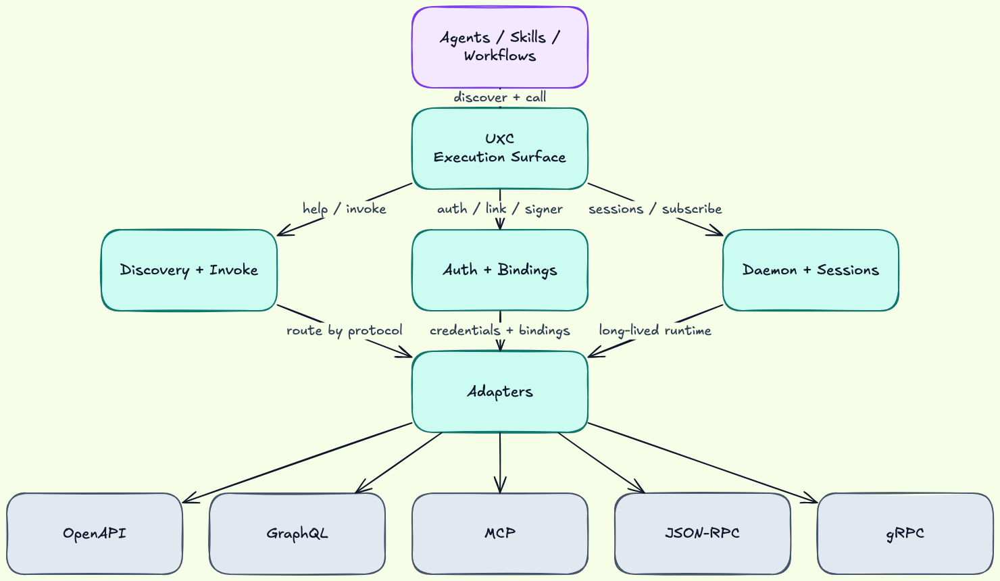

# UXC

**Universal X-Protocol CLI**

A stable execution surface for agents.

English | [简体中文](README.zh-CN.md)

[](https://github.com/holon-run/uxc/actions)
[](https://github.com/holon-run/uxc/actions/workflows/coverage.yml)
[](https://opensource.org/licenses/MIT)
[](https://www.rust-lang.org)

UXC gives agents one stable way to discover, authenticate, and call remote tools across
OpenAPI, gRPC, GraphQL, MCP, and JSON-RPC.

Instead of writing separate glue for each protocol, SDK, or local MCP setup, UXC turns
remote interfaces into one predictable command contract with help-first discovery,
structured execution, and deterministic JSON output.

## Why UXC Exists

Agent tool use usually breaks down in the same places:

- auth scattered across prompts, scripts, and local setup
- different invocation models for each protocol
- local MCP server names and config that are not portable across machines
- large tool manifests or schemas pushed into prompt context
- one-off wrappers that drift from upstream interfaces

UXC exists to make remote capabilities feel like one stable execution surface for agents
and automation.

## What UXC Does

- Discover operations from an endpoint on demand
- Inspect input and output shape before execution
- Execute operations with structured arguments
- Return deterministic JSON envelopes by default
- Reuse auth bindings, signer profiles, and linked shortcuts

If a target can describe itself, UXC can usually call it.

## Why It Works Well With Agents and Skills

- Progressive discovery keeps context small: `<host> -h`, `<host> <operation_id> -h`, then execute
- URL-first usage avoids dependency on machine-specific MCP aliases or local wrapper names
- Auth bindings externalize credential matching instead of burying it in prompts
- Linked shortcuts (`uxc link`) turn remote endpoints into stable local commands
- The same command contract can be reused across many skills and workflows

## Core Capabilities

- URL-first usage: call endpoints directly, no server alias required
- Multi-protocol detection and adapter routing
- Schema-driven operation discovery (`<host> -h`, `<host> <operation_id> -h`)
- Structured invocation (positional JSON, key-value args)
- Deterministic JSON envelopes for automation and agents
- Auth model with reusable credentials, bindings, and signer profiles
- App-credential bootstrap for short-lived bearer tokens (for example, Feishu/Lark and DingTalk)
- Host shortcut commands via `uxc link`
- Link-level default OpenAPI schema persistence via `uxc link --schema-url`
- Daemon-backed background subscriptions via `uxc subscribe`
- Provider-aware event transports for Slack Socket Mode, Discord Gateway, and Feishu long connection
- Stdio child-process auth injection via `--inject-env NAME={{secret}}`

Supported protocols:

- OpenAPI / Swagger
- gRPC (server reflection)
- GraphQL (introspection)
- MCP (HTTP and stdio)
- JSON-RPC (OpenRPC-based discovery)

## Architecture Snapshot

UXC keeps protocol diversity behind one execution contract:



This design keeps discovery, auth, and execution stable while allowing protocol-specific
internals.

## Target Use Cases

- AI agents and skills that need deterministic remote tool execution
- CI/CD and automation jobs that need schema-driven calls without SDK setup
- Cross-protocol integration testing with one command contract
- Controlled runtime environments where JSON envelopes and predictable errors matter

## Non-Goals

UXC is not:

- a code generator
- an SDK framework
- an API gateway or reverse proxy

UXC is a stable execution surface for remote capabilities that can describe themselves.

## Install

### Homebrew (macOS/Linux)

```bash
brew tap holon-run/homebrew-tap
brew install uxc
```

### Install Script (macOS/Linux)

```bash
curl -fsSL https://raw.githubusercontent.com/holon-run/uxc/main/scripts/install.sh | bash
```

Review before running:

```bash
curl -fsSL https://raw.githubusercontent.com/holon-run/uxc/main/scripts/install.sh -o install-uxc.sh
less install-uxc.sh
bash install-uxc.sh
```

Install a specific version:

```bash
curl -fsSL https://raw.githubusercontent.com/holon-run/uxc/main/scripts/install.sh | bash -s -- -v v0.12.3
```

Windows note: native Windows is no longer supported; run UXC through WSL.

### Cargo

```bash
cargo install uxc
```

### From Source

```bash
git clone https://github.com/holon-run/uxc.git
cd uxc
cargo install --path .
```

## Quickstart (3 Minutes)

Most HTTP examples omit the scheme for brevity.
For public hosts, UXC infers `https://` when omitted.

1. Discover operations:

```bash
uxc petstore3.swagger.io/api/v3 -h
```

2. Inspect operation schema:

```bash
uxc petstore3.swagger.io/api/v3 get:/pet/{petId} -h
```

3. Execute with structured input:

```bash
uxc petstore3.swagger.io/api/v3 get:/pet/{petId} petId=1
```

Use only these endpoint forms:
- `uxc <host> -h`
- `uxc <host> <operation_id> -h`
- `uxc <host> <operation_id> key=value` or `uxc <host> <operation_id> '{...}'`

For nested object or array inputs, key-value mode also supports dotted and indexed paths:

```bash
uxc <host> <operation_id> \
  prompt="summarize this file" \
  attachmentPaths[0]=/tmp/spec.pdf
```

## Protocol Examples (One Each)

Operation ID conventions:

- OpenAPI: `method:/path` (example: `get:/users/{id}`)
- gRPC: `Service/Method`
- GraphQL: `query/viewer`, `mutation/createUser`
- MCP: tool name (example: `ask_question`)
- JSON-RPC: method name (example: `eth_getBalance`)

### OpenAPI

```bash
uxc petstore3.swagger.io/api/v3 -h
uxc petstore3.swagger.io/api/v3 get:/pet/{petId} petId=1
```

For schema-separated services, you can override schema source:

```bash
uxc api.github.com -h \
  --schema-url https://raw.githubusercontent.com/github/rest-api-description/main/descriptions/api.github.com/api.github.com.json
```

### gRPC

```bash
uxc grpcb.in:9000 -h
uxc grpcb.in:9000 addsvc.Add/Sum a=1 b=2
```

Note: gRPC unary runtime invocation requires `grpcurl` on `PATH`.

### GraphQL

```bash
uxc countries.trevorblades.com -h
uxc countries.trevorblades.com query/country code=US
# Prefer positional JSON for non-string object arguments
uxc api.linear.app/graphql mutation/issueCreate '{"input":{"teamId":"TEAM_ID","title":"Test"}}'
# Optional: control GraphQL return fields via reserved _select argument
uxc api.linear.app/graphql query/issues '{"first":5,"_select":"nodes { identifier title url state { name } }"}'
```

### MCP

```bash
uxc mcp.deepwiki.com/mcp -h
uxc mcp.deepwiki.com/mcp ask_question repoName=holon-run/uxc question='What does this project do?'
```

### MCP (stdio)

UXC can also invoke MCP servers started as local processes over stdio.
For stdio endpoints, the "URL" is a quoted command line.

Playwright MCP (stdio) example:

```bash
# One-off discovery
uxc "npx -y @playwright/mcp@latest --headless --isolated" -h

# Create a stable command name for repeated use (recommended)
uxc link playwright-mcp-cli "npx -y @playwright/mcp@latest --headless --isolated"
playwright-mcp-cli -h

# Inspect an operation before calling it
playwright-mcp-cli browser_navigate -h

# Call operations with key=value args
playwright-mcp-cli browser_navigate url=https://example.com
playwright-mcp-cli browser_snapshot
```

### JSON-RPC

```bash
uxc fullnode.mainnet.sui.io -h
uxc fullnode.mainnet.sui.io sui_getLatestCheckpointSequenceNumber
```

## Skills

UXC provides one canonical skill plus scenario-specific official wrappers.
Use `uxc` skill as the shared execution layer, and add wrappers when they fit your workflow.

### Start Here

- [`uxc`](skills/uxc/SKILL.md): canonical schema discovery and multi-protocol execution layer
- [`playwright-mcp-skill`](skills/playwright-mcp-skill/SKILL.md): browser automation over MCP stdio through `uxc`
- [`context7-mcp-skill`](skills/context7-mcp-skill/SKILL.md): current library documentation and examples over MCP

See [`docs/skills.md`](docs/skills.md) for publish history, validation notes, and ClawHub maintenance details.

<details>
<summary>Core and Skill Authoring</summary>

- [`uxc`](skills/uxc/SKILL.md): canonical schema discovery and multi-protocol execution layer
- [`uxc-skill-creator`](skills/uxc-skill-creator/SKILL.md): templates and workflow guidance for building new UXC-based skills

</details>

<details>
<summary>Browser Automation and Documentation</summary>

- [`playwright-mcp-skill`](skills/playwright-mcp-skill/SKILL.md): run `@playwright/mcp` over MCP stdio through `uxc`
- [`chrome-devtools-mcp-skill`](skills/chrome-devtools-mcp-skill/SKILL.md): drive Chrome DevTools MCP through `uxc`
- [`context7-mcp-skill`](skills/context7-mcp-skill/SKILL.md): query up-to-date library documentation and examples
- [`deepwiki-mcp-skill`](skills/deepwiki-mcp-skill/SKILL.md): query repository documentation and ask codebase questions

</details>

<details>
<summary>Workspace and Messaging</summary>

- [`notion-mcp-skill`](skills/notion-mcp-skill/SKILL.md): operate Notion MCP workflows with OAuth-aware guidance
- [`linear-graphql-skill`](skills/linear-graphql-skill/SKILL.md): operate Linear issues, projects, and teams through GraphQL
- [`slack-openapi-skill`](skills/slack-openapi-skill/SKILL.md): operate Slack Web API and receive inbound Socket Mode events through `uxc subscribe`
- [`discord-openapi-skill`](skills/discord-openapi-skill/SKILL.md): operate Discord REST API and receive Gateway events through `uxc subscribe`
- [`feishu-openapi-skill`](skills/feishu-openapi-skill/SKILL.md): operate Feishu/Lark IM APIs with bootstrap-managed auth and long-connection event intake
- [`telegram-openapi-skill`](skills/telegram-openapi-skill/SKILL.md): operate Telegram Bot API and receive updates through polling-based `uxc subscribe`
- [`matrix-openapi-skill`](skills/matrix-openapi-skill/SKILL.md): operate Matrix Client-Server API and follow room timelines through `/sync` polling
- [`dingtalk-openapi-skill`](skills/dingtalk-openapi-skill/SKILL.md): operate DingTalk OpenAPI workflows with app bootstrap auth guidance
- [`line-openapi-skill`](skills/line-openapi-skill/SKILL.md): operate LINE Messaging API request/response workflows
- [`whatsapp-openapi-skill`](skills/whatsapp-openapi-skill/SKILL.md): operate WhatsApp Cloud API request/response workflows

</details>

<details>
<summary>Crypto and Web3</summary>

- [`alchemy-openapi-skill`](skills/alchemy-openapi-skill/SKILL.md): query Alchemy prices and market endpoints through OpenAPI
- [`binance-spot-openapi-skill`](skills/binance-spot-openapi-skill/SKILL.md): operate Binance Spot public market data and signed account/order flows through OpenAPI
- [`binance-spot-websocket-skill`](skills/binance-spot-websocket-skill/SKILL.md): subscribe to Binance Spot public trade, ticker, depth, and book-ticker streams via raw WebSocket
- [`binance-web3-openapi-skill`](skills/binance-web3-openapi-skill/SKILL.md): query Binance Web3 token discovery, rankings, smart money, audits, and address positions through OpenAPI
- [`birdeye-mcp-skill`](skills/birdeye-mcp-skill/SKILL.md): use Birdeye MCP for token discovery and market reads
- [`bitget-openapi-skill`](skills/bitget-openapi-skill/SKILL.md): operate Bitget exchange APIs through OpenAPI
- [`bitquery-graphql-skill`](skills/bitquery-graphql-skill/SKILL.md): query Bitquery GraphQL for trades, transfers, holders, balances, and realtime subscription flows
- [`blockscout-openapi-skill`](skills/blockscout-openapi-skill/SKILL.md): read Blockscout explorer data through OpenAPI
- [`bybit-openapi-skill`](skills/bybit-openapi-skill/SKILL.md): operate Bybit exchange APIs through OpenAPI
- [`chainbase-openapi-skill`](skills/chainbase-openapi-skill/SKILL.md): query Chainbase Web3 data APIs through OpenAPI
- [`coinapi-openapi-skill`](skills/coinapi-openapi-skill/SKILL.md): read CoinAPI market data through OpenAPI
- [`coinbase-openapi-skill`](skills/coinbase-openapi-skill/SKILL.md): operate Coinbase Advanced Trade APIs through OpenAPI
- [`coingecko-openapi-skill`](skills/coingecko-openapi-skill/SKILL.md): read CoinGecko public market data through OpenAPI
- [`coinmarketcap-mcp-skill`](skills/coinmarketcap-mcp-skill/SKILL.md): use CoinMarketCap MCP for quotes, market overview, and narratives
- [`crypto-com-mcp-skill`](skills/crypto-com-mcp-skill/SKILL.md): use Crypto.com MCP for exchange market data
- [`defillama-openapi-skill`](skills/defillama-openapi-skill/SKILL.md): use DefiLlama public APIs through OpenAPI
- [`defillama-prices-openapi-skill`](skills/defillama-prices-openapi-skill/SKILL.md): query DefiLlama prices APIs through OpenAPI
- [`defillama-pro-openapi-skill`](skills/defillama-pro-openapi-skill/SKILL.md): use DefiLlama Pro APIs through OpenAPI
- [`defillama-yields-openapi-skill`](skills/defillama-yields-openapi-skill/SKILL.md): query DefiLlama yields APIs through OpenAPI
- [`dune-mcp-skill`](skills/dune-mcp-skill/SKILL.md): discover blockchain tables, run SQL, fetch results, and build charts via Dune MCP
- [`ethereum-jsonrpc-skill`](skills/ethereum-jsonrpc-skill/SKILL.md): use Ethereum JSON-RPC via curated OpenRPC metadata
- [`etherscan-mcp-skill`](skills/etherscan-mcp-skill/SKILL.md): investigate addresses, token holders, and contracts via Etherscan MCP
- [`gate-mcp-skill`](skills/gate-mcp-skill/SKILL.md): use Gate MCP for exchange market data and discovery workflows
- [`goldrush-mcp-skill`](skills/goldrush-mcp-skill/SKILL.md): use GoldRush MCP for wallet, market, and token workflows
- [`kraken-openapi-skill`](skills/kraken-openapi-skill/SKILL.md): operate Kraken exchange APIs through OpenAPI
- [`kucoin-openapi-skill`](skills/kucoin-openapi-skill/SKILL.md): operate KuCoin exchange APIs through OpenAPI
- [`lifi-mcp-skill`](skills/lifi-mcp-skill/SKILL.md): use LI.FI MCP for cross-chain route discovery and execution planning
- [`mexc-openapi-skill`](skills/mexc-openapi-skill/SKILL.md): operate MEXC exchange APIs through OpenAPI
- [`moralis-openapi-skill`](skills/moralis-openapi-skill/SKILL.md): query Moralis Web3 Data APIs through OpenAPI
- [`okx-exchange-websocket-skill`](skills/okx-exchange-websocket-skill/SKILL.md): subscribe to OKX public exchange ticker, trade, book, and candle channels via raw WebSocket
- [`okx-mcp-skill`](skills/okx-mcp-skill/SKILL.md): query OKX MCP for token, market, wallet, and swap workflows
- [`sui-jsonrpc-skill`](skills/sui-jsonrpc-skill/SKILL.md): use Sui JSON-RPC via curated OpenRPC metadata
- [`thegraph-mcp-skill`](skills/thegraph-mcp-skill/SKILL.md): discover subgraphs, inspect schemas, and execute GraphQL via The Graph Subgraph MCP bridge
- [`thegraph-token-mcp-skill`](skills/thegraph-token-mcp-skill/SKILL.md): query token, wallet, transfer, holder, and market data via The Graph Token API MCP
- [`upbit-openapi-skill`](skills/upbit-openapi-skill/SKILL.md): operate Upbit exchange APIs through OpenAPI

</details>

### Install Skills

Use the skill folder name as the skill id for both `npx skills` and ClawHub.

Install from this repository using `npx skills`:

```bash
# Install the shared execution layer only
npx -y skills@latest add holon-run/uxc --skill uxc --agent codex -y

# Install any selected bundle of skills from this repo
npx -y skills@latest add holon-run/uxc \
  --skill uxc \
  --skill slack-openapi-skill \
  --skill discord-openapi-skill \
  --skill bitquery-graphql-skill \
  --agent codex -y
```

Install published skills from ClawHub:

```bash
# Install the shared execution layer only
clawhub --workdir ~/.openclaw --dir skills install uxc

# Install any selected published skill by its folder/slug name
clawhub --workdir ~/.openclaw --dir skills install slack-openapi-skill
clawhub --workdir ~/.openclaw --dir skills install chrome-devtools-mcp-skill
clawhub --workdir ~/.openclaw --dir skills install defillama-openapi-skill
```

See [`docs/skills.md`](docs/skills.md) for the complete publish log and maintenance rules.

## Output and Help Conventions

UXC is JSON-first by default.
Use `--text` (or `--format text`) when you want human-readable CLI output.

Examples:

```bash
uxc
uxc help
uxc <host> -h
uxc <host> <operation_id> -h
uxc --text help
```

Note: In endpoint routing, `help` is treated as a literal operation name, not a help alias.

Success envelope shape:

```json
{
  "ok": true,
  "kind": "call_result",
  "protocol": "openapi",
  "endpoint": "https://petstore3.swagger.io/api/v3",
  "operation": "get:/pet/{petId}",
  "data": {},
  "meta": {
    "version": "v1",
    "duration_ms": 128
  }
}
```

For MCP `tools/call`, `data` may include `content`, optional `structuredContent`, and optional `isError`.

Failure envelope shape:

```json
{
  "ok": false,
  "error": {
    "code": "INVALID_ARGUMENT",
    "message": "Field 'id' must be an integer"
  },
  "meta": {
    "version": "v1"
  }
}
```

## Auth (Credentials + Bindings)

UXC authentication has two resources:

- Credentials: secret material and auth type
- Bindings: endpoint matching rules that select a credential

For non-OAuth credentials, use two auth tracks:

- simple auth: keep using `--secret`, `--secret-env`, or `--secret-op`
- complex auth: use repeatable `--field <name>=<source>` plus optional binding-level `--signer-json`

Example:

```bash
uxc auth credential set deepwiki --auth-type bearer --secret-env DEEPWIKI_TOKEN
uxc auth credential set deepwiki --secret-op op://Engineering/deepwiki/token
uxc auth binding add --id deepwiki-mcp --host mcp.deepwiki.com --path-prefix /mcp --scheme https --credential deepwiki --priority 100

# api_key supports configurable header names and templates
uxc auth credential set okx --auth-type api_key --secret-env OKX_ACCESS_KEY --api-key-header OK-ACCESS-KEY
uxc auth credential set okx-advanced --auth-type api_key --header "OK-ACCESS-KEY={{secret}}" --header "OK-ACCESS-PASSPHRASE={{env:OKX_PASSPHRASE}}"

# multi-field auth for signed APIs
uxc auth credential set binance --auth-type api_key --field api_key=env:BINANCE_API_KEY --field secret_key=env:BINANCE_SECRET_KEY
uxc auth binding add --id binance-account --host api.binance.com --path-prefix /api/v3 --scheme https --credential binance --signer-json '{"kind":"hmac_query_v1","algorithm":"hmac_sha256","signing_field":"secret_key","key_field":"api_key","key_placement":"header","key_name":"X-MBX-APIKEY","signature_param":"signature","signature_encoding":"hex","timestamp_param":"timestamp","timestamp_unit":"milliseconds","canonicalization":{"mode":"preserve_order"}}' --priority 100
```

For `--secret-op`, secret resolution happens at request runtime through daemon execution.
Ensure daemon has usable 1Password auth context (for example `OP_SERVICE_ACCOUNT_TOKEN`), and restart daemon after env changes.

OAuth for MCP HTTP is supported (device code, client credentials, authorization code + PKCE).
See [`docs/oauth-mcp-http.md`](docs/oauth-mcp-http.md) for full workflows.

## Docs Map

- Extended quickstart and protocol walkthroughs: [`docs/quickstart.md`](docs/quickstart.md)
- Public no-key endpoints for protocol checks: [`docs/public-endpoints.md`](docs/public-endpoints.md)
- Logging and troubleshooting with `RUST_LOG`: [`docs/logging.md`](docs/logging.md)
- Auth credential secret sources (`literal/env/op`): [`docs/auth-secret-sources.md`](docs/auth-secret-sources.md)
- Run daemon with service managers (`systemd`/`launchd`): [`docs/daemon-service.md`](docs/daemon-service.md)
- OpenAPI schema mapping and `--schema-url`: [`docs/schema-mapping.md`](docs/schema-mapping.md)
- Skills overview and install/maintenance guidance: [`docs/skills.md`](docs/skills.md)
- Release process: [`docs/release.md`](docs/release.md)

## Contributing

Contributions are welcome.

- Development workflow and quality bar: [`CONTRIBUTING.md`](CONTRIBUTING.md)
- CI and release flows: [GitHub Actions](https://github.com/holon-run/uxc/actions)

## License

MIT License - see [`LICENSE`](LICENSE).
